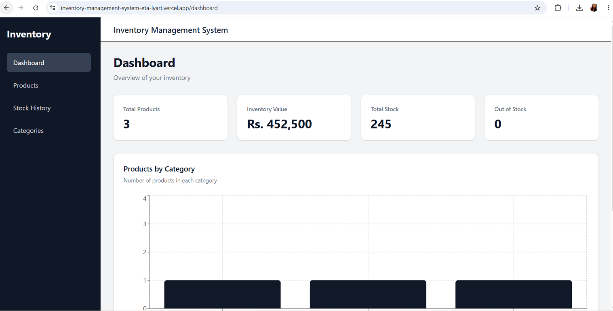
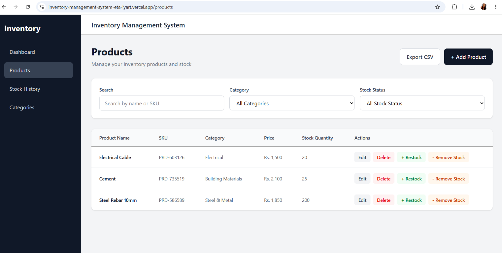
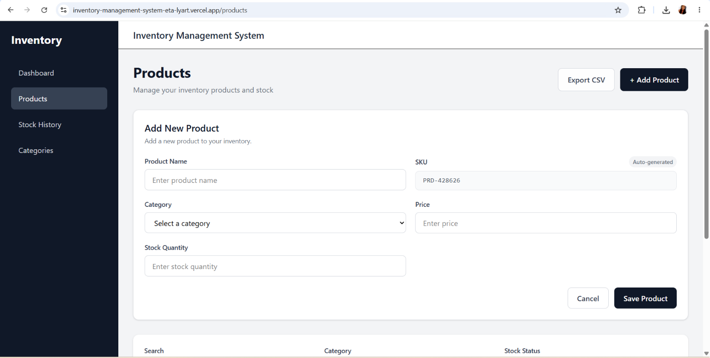
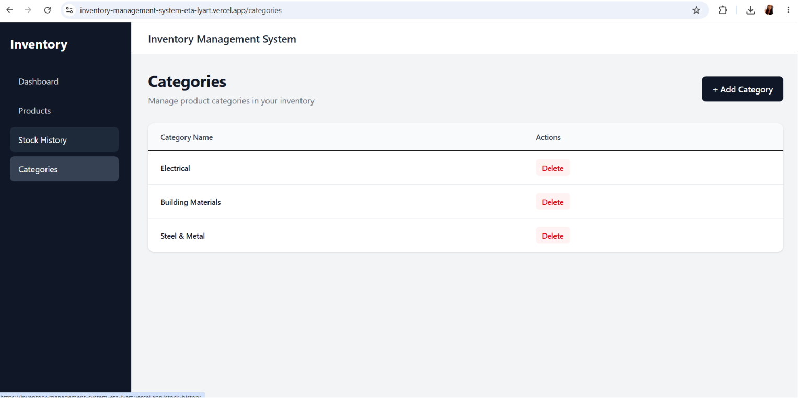
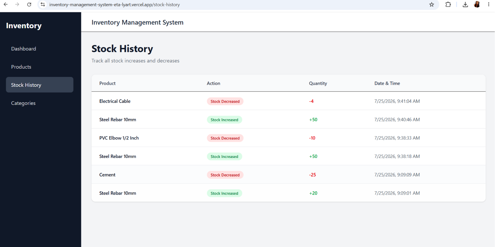
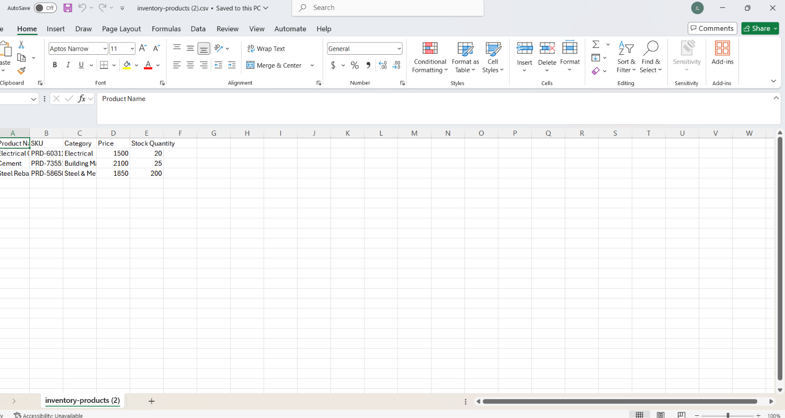
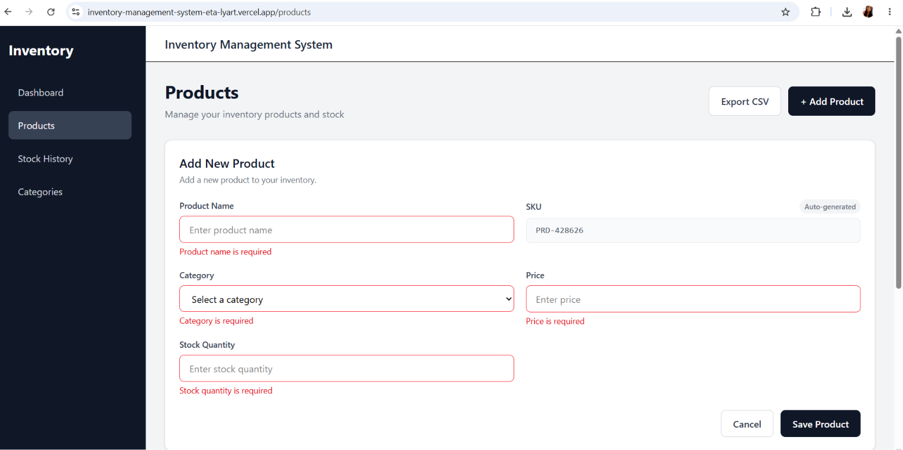

# Inventory Management System

A frontend-only Inventory Management System built with React and TypeScript. The application allows users to manage products, categories, stock levels, inventory statistics, and stock movement history.

All application data is persisted using the browser's `localStorage`, so no backend or database is required.

---

## Features

### Product Management

- Add new products
- Edit existing products
- Delete products
- Automatically generate unique SKUs
- Store product name, SKU, category, price, and stock quantity
- Form validation using Formik and Yup

### Stock Management

- Increase stock quantity through restocking
- Decrease stock quantity through outgoing stock
- Prevent stock quantity from becoming negative
- Validate stock movement quantities
- Record every stock movement in stock history

### Category Management

- Create custom categories
- Delete categories
- Prevent deletion of categories currently assigned to products
- Filter products by category
- Display product counts by category on the dashboard

### Search and Filtering

- Search products by name
- Search products by SKU
- Filter products by category
- Filter products by stock status:
  - In Stock
  - Out of Stock

### Dashboard and Statistics

The dashboard provides an overview of the inventory, including:

- Total number of products
- Total inventory value
- Total stock quantity
- Number of out-of-stock products
- Product count by category
- Category distribution analytics chart

### Stock History

- Record stock increases and decreases
- Store the product name and product ID
- Store the quantity changed
- Store the timestamp of each stock movement
- Display the newest stock movements first

### CSV Export

- Export the full product list as a CSV file
- Include product name, SKU, category, price, and stock quantity
- Properly handle CSV values containing commas and quotation marks

### User Feedback Notifications

- Implemented toast notifications using `react-hot-toast`
- Displays success messages when products and categories are created, updated, deleted, or stock is modified
- Displays error messages for invalid actions, such as attempting to delete a category that is currently assigned to products
- Uses confirmation dialogs for destructive actions before deletion

---

## Tech Stack

- React
- TypeScript
- Vite
- React Router
- Formik
- Yup
- Tailwind CSS
- Recharts
- Browser localStorage
- React Hot Toast
- Vercel

---

## Project Structure

```text
src/
├── components/
│   ├── AppLayout.tsx
│   ├── CategoryChart.tsx
|   ├── CategoryForm.tsx
|   ├── Navigation.tsx
│   ├── ProductForm.tsx
│   └── StockForm.tsx
│
├── pages/
│   ├── Dashboard.tsx
│   ├── Products.tsx
│   ├── Categories.tsx
│   └── StockHistory.tsx
│
├── utils/
│   ├── categoryStorage.ts
│   ├── stockHistoryStorage.ts
│   ├── storage.ts
│   ├── sku.ts
|   ├── csv.ts
│   └── types.ts
│
├── App.tsx
├── main.tsx
├── index.css
└── vite-env.d.ts
```

---

## Getting Started

### Prerequisites

Make sure you have the following installed:

- npm

### Installation

Clone the repository:

```bash
git clone https://github.com/OshadiJayananda/inventory-management-system
```

Navigate to the project directory:

```bash
cd inventory-management-system
```

Install the dependencies:

```bash
npm install
```

### Run the Development Server

```bash
npm run dev
```

Open the local URL displayed in the terminal, usually:

```text
http://localhost:5173
```

---

## Data Persistence

This is a frontend-only application.

No backend or database is used. Application data is stored in the browser using `localStorage`.

The application uses separate storage keys for different types of data:

```text
inventory_products
inventory_categories
inventory_stock_history
```

This allows product data, category data, and stock history to persist even after refreshing the browser.

---

## Form Validation

Formik and Yup are used for form handling and validation.

### Product Form

- Product name is required
- Product name must meet the minimum length requirement
- SKU is required
- Category is required
- Price must be a valid positive number
- Stock quantity cannot be negative

### Category Form

- Category name is required
- Category name must meet the minimum length requirement
- Category name cannot exceed the maximum length requirement

### Stock Form

- Quantity is required
- Quantity must be a whole number
- Quantity must be greater than zero
- Stock cannot be decreased below zero

---

## Application Routes

| Route            | Description                             |
| ---------------- | --------------------------------------- |
| `/dashboard`     | View inventory statistics and analytics |
| `/products`      | Manage products and stock               |
| `/categories`    | Manage inventory categories             |
| `/stock-history` | View stock movement history             |

---

## Screenshots

### Dashboard



### Products



### Product Form



### Categories



### Stock History



### csv File



### Product Validation



---

## Author

Oshadi Jayananda

## Demo Video

Watch the application demonstration:

https://drive.google.com/file/d/1gSVSVoHmAmVbPGWS5zqI86CEHCakS2ny/view?usp=sharing
